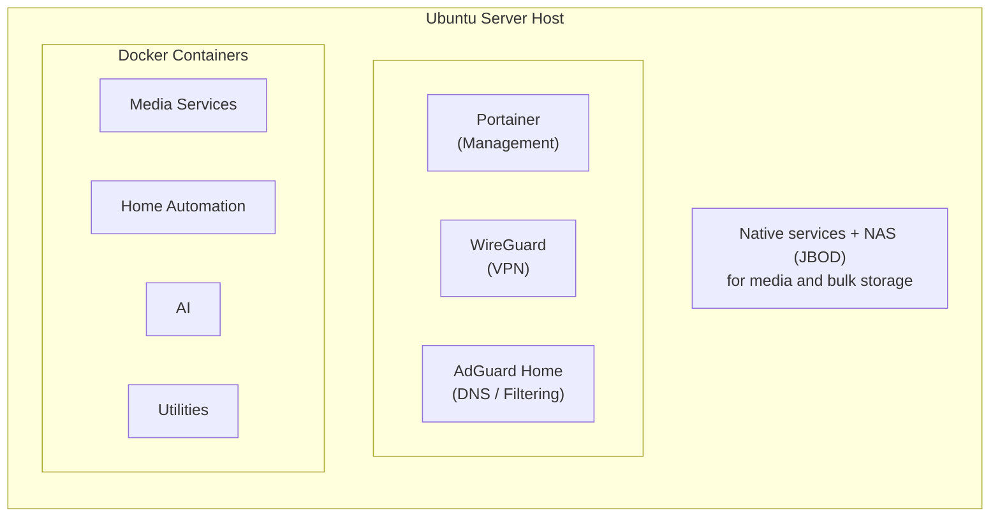

# Architecture Overview

## Host Environment

- **Operating System**: Ubuntu Server
- **Container Runtime**: Docker + Docker Compose
- **Container Management**: Portainer
- **Storage**: Network-attached storage (NAS) configured in JBOD
- **Primary Goal**: Reliable, maintainable self-hosted services for myself and family with a strong focus on containerization

The lab runs on a single physical host. Application workloads are primarily delivered as Docker containers, while core system services remain native where appropriate.

## High-Level Design

## Key Design Decisions

- **Container-first approach** for application workloads to improve portability, isolation, and ease of updates.
- **Centralized management** via Portainer for visibility and control of all containers.
- **Secure remote access** using WireGuard VPN rather than exposing individual services to the internet.
- **Dynamic DNS** (FreeDNS) to maintain reliable remote connectivity.
- **Media storage** on a dedicated NAS using JBOD for flexible capacity expansion.
- Clear logical grouping of services (Media, Home Automation, Management, etc.) for easier maintenance and documentation.

## Service Categories

| Category              | Purpose                              | Examples                          |
|-----------------------|--------------------------------------|-----------------------------------|
| Media Services        | Personal media and content platform  | Jellyfin, Immich, Audiobookshelf  |
| Home Automation       | Smart home control and integration   | Home Assistant, Zigbee2MQTT       |
| Networking & Access   | Secure remote connectivity           | WireGuard, AdGuard Home           |
| Management & Utilities| Operations, monitoring, dashboards   | Portainer, Homepage, NTFY         |
| AI / Local LLM        | Local large language model access    | Ollama, Open WebUI                |

## Future Improvements

- Enhanced monitoring and alerting
- More formal infrastructure-as-code practices
- Improved backup verification processes
- Additional documentation of recovery procedures
